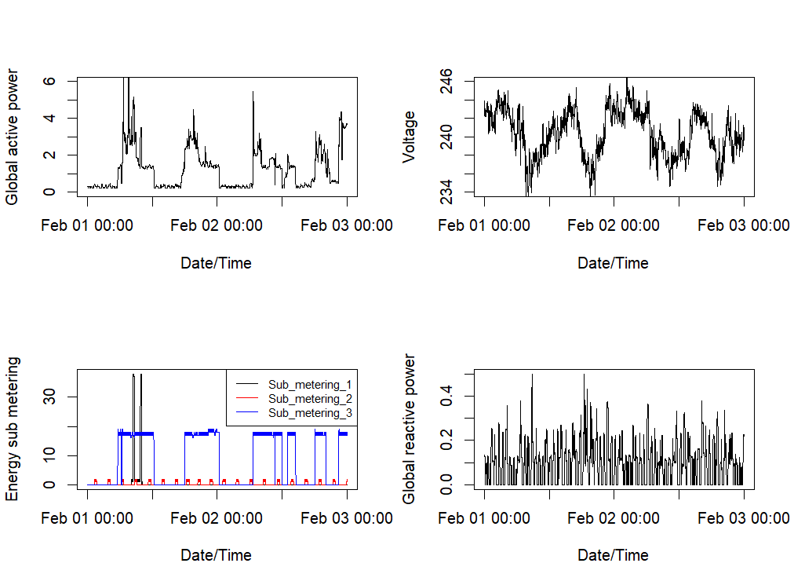

# 📊 Exploratory Data Analysis — Project 5

This repository contains the results of **Project 5** from the [Johns Hopkins University Data Science Specialization](https://www.coursera.org/specializations/jhu-data-science),
focused on exploratory data analysis using household power consumption data.

## 📁 Files

| File | Description |
|-------------|--------------------------------------------------|
| Plot-1.png | Histogram of Global Active Power. |
| Plot-2.png | Line graph of Global Active Power over time. |
| Plot-3.png | Time series comparing Sub_metering_1, 2, and 3. |
| Plot-4.png | Four-panel layout of power-related variables. |
| Plot.R | R script used to load, clean, and generate plots. |

## 📅 Date Range

Data filtered to only include:
**February 1, 2007** to **February 2, 2007**

## 📦 Dataset

The dataset used is:  
**Individual household electric power consumption Data Set**  
[UCI Machine Learning Repository](https://archive.ics.uci.edu/ml/datasets/Individual+household+electric+power+consumption)

## 🛠️ Tools & Libraries

- R (base plotting system)
- tidyverse
- dplyr
- readr
- lubridate

## 🖼️ Example Visualization

Below is an example of `Plot-4.png` — a 2x2 layout of different power consumption trends:

|  |
|:--:|
| *Energy metrics plotted across two days* |

## 🚀 Purpose

The goal was to practice:
- Data wrangling with R
- Plotting and interpreting time-series data
- Creating reproducible plots with layered information
